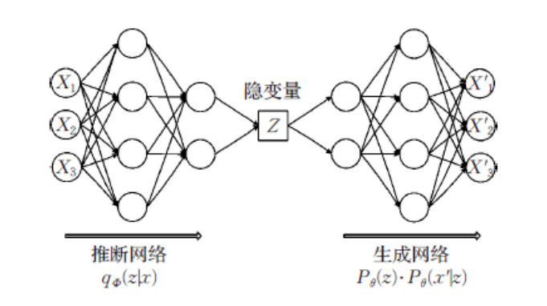
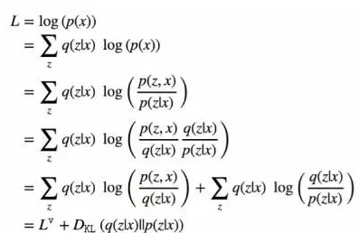
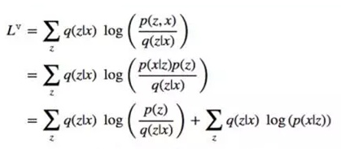
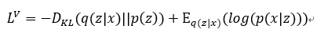

#! https://zhuanlan.zhihu.com/p/344546057
# VAE v.s. CVAE 直观理解

VAE(Variational Auto Encoder) 和 CVAE(Conditional VAE)现在用的越来越多，但是如果直接从数学公式中理解的话，还挺困难。  

尤其是之前很多的教程文章都是在进行公式推导，但是并没有说清楚VAE究竟为什么存在，以及怎么使用。因此决定，直观的看一下公式中的每一项的含义，以及他们具体是怎么工作的。

## 使用场景

众所周知，VAE 和 CVAE 都是生成模型。从字面上就能看出来，VAE 是纯粹的生成模型，也就是说不能控制它生成什么东西，而 CVAE 可以根据给定的标签进行生成。

比如说同样在手写数字 `MNIST` 数据集上，VAE 是乱来的，它生成的只能是根据单位高斯中采样的隐变量 `z` 生成的东西。也就是说只能保证生成的是手写数字，但是不能保证生成的是多少。但是　`CVAE` 就接受输入标签，比如说可以用希望输入的数字作为标签，如果给定标签 `6`，那么CVAE可以生成各种各样的 `66666666`。

这个大概就是 VAE 和 CVAE 之间的区别。

## VAE  

VAE的整体结构如下图所示
  

整个结构整体上是遵循 `AutoEncoder` 的编解码器结构。有一点很重要的是隐变量 z 是从一个分布中采样得到的。也就是说具有一定的随机性，而不是 `AutoEncoder` 中的确定性的。

### 详解

整个VAE是基于概率模型的，我们希望生成的是 $x\in{X}$，最直接的想法就是直接从 $P(X)$ 中采样。但是问题是我们并不知道 $P(X)$ 的分布是什么样的。所以我们退一步，从一个已知分布的隐空间 $Z$ 中进行采样，然后进行生成，生成器是一个神经网络，把它的参数记作 $\theta$。这里假设 $Z$ 服从 **单位高斯分布**
$$
P(X') = \int_ZP_{\theta}(X'|Z)P(Z)
$$

我们需要保证，对于根据 $Z$ 生成出来的结果 $X'$，仍然服从分布 $P(X)$，所以生成网络优化的目标就是让 $P_{\phi}(X|Z)$ 尽可能大。

这个其实很容易实现，对于一个采样出来的隐变量 $z_i$ 和它的对应输入 $x_i$，我们只需要对生成模型的输出 $x_i'$ 和 $x_i$ 做 $L_2$Loss就可以。那么现在的问题是

**如何把 $z_i$ 和 $x_i$ 进行配对？？？** 对于训练集中的数据 $x_i$，必须找到相应的 $z_i$ 才能进行训练。

答案仍然是使用神经网络进行映射。这里的映射有一个限制，就是我们之前的假设 $P(Z)$ 服从 $N(0, 1)$。

对于每一个数据 $x_i$ 我们都希望它能够找到对应的 $z_i$，也就是说我们希望推断网络代表的分布 $q_\phi(Z|X)$ 去学习 $p(Z|X)$。这里的学习方法，就和变分推断有关了。

首先由公式

可以看出 $L$ 显然是一个定值，那么如果想要最小化第二项的KL散度，需要通过最大化 $L^v$ 来实现。

  
我们的假设是 $P(Z)$ 服从标准高斯分布，$P(Z|X)=N(Z|\mu(x), \sigma^2(x)*I)$ 服从高斯分布。推断网络的输出是 $\mu, \sigma$，因此可以利用高斯分布的KL散度的计算公式直接计算。后面一部分的按理来讲需要用蒙特卡罗方法进行计算，但是这里我们可以利用上文中说的 $L_2$ Loss 直接进行优化。

再次看这个计算Loss的公式，我们可以发现，第一项的KL散度是用来保证隐变量 $Z$ 的总体是服从单位高斯分布的，后边一项是保证生成器可以很好的从隐变量还原到数据。  

需要注意的是，虽然$Z$ 的总体是服从单位高斯分布的，但是分布 $P(Z|X)$ 只是普通的高斯分布。对于一个特定的训练数据 $x_i$ 整个 Loss 函数会让它尽量向单位高斯靠拢，但是又同时需要它保证自己的特异性，是一个 trade off 。因此之后会出现了 $\beta-VAE$。也就是将 Loss 函数改成了 $L^V = -D_{KL}(q(z|x)||p(z))+\beta\cdot E_{q(z|x)}(log(p(x|z)))$。其中的 $\beta$ 是一个超参数，可以调节模型的生成能力。

整个模型的精髓在于损失函数中的第一项里面的KL散度，引入了噪声，保证了模型的生成能力。

## CVAE

CVAE中需要根据输入来进行输出。也就是说训练集中是数据对 （x, y), x 是输入，也就是condition，y是我们期待的输出。  

因此，我们采样的时候，不再是从 $P(Z)$ 中直接采样，而是从 $P(Z|X)$ 中进行采样，因此假设变成了，$P(Z|X)=N(Z|\mu(X), I)$

相应的，整个损失函数变成了

$$
L^V=-D_{KL}(q(z|x, y)||p(z|x))+E_{q(z|x, y)}(log(p(y|z, x)))
$$

条件 $x$ 要同时输入到 encoder 和 decoder 中。

这个改变还是很直观的，就是通过条件改变隐变量的均值，从而控制了隐变量采样的位置，控制最后的输出结果。
